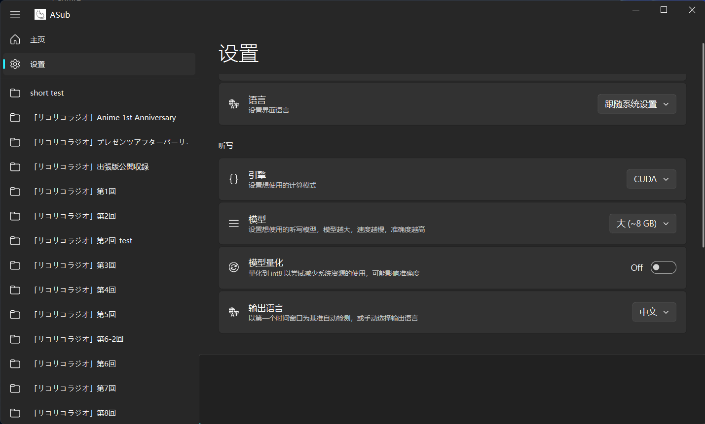

# ASub
Another Whisper GUI



## Release
### Build

```bash
pyinstaller -n asub --clean --noconsole --add-data "VERSION;." --add-data "app/ui/resource;app/ui/resource" --icon "app/ui/resource/logo.ico" --collect-data whisper.assets asub.py
```
For Linux, change the `;`(semicolon) to `:`(colon) in `--add-data` option  
because pyinstaller use `os.pathsep` to parse this value

### Package
Install **Inno Setup** first, then run:
```bash
ISCC.exe "asub_installer.iss"
```
